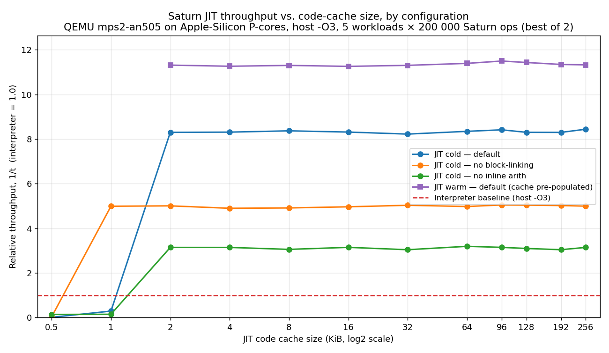
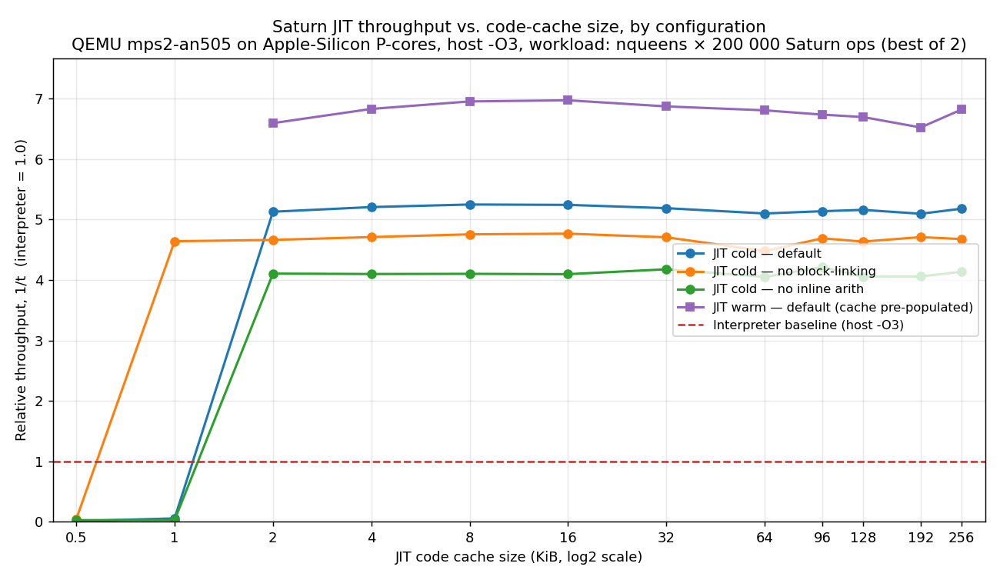

# saturn_jit_m33

A JIT-compiling HP Saturn CPU emulator targeted at the ARM Cortex-M33,
benchmarked under QEMU `mps2-an505` with ARM semihosting.

The interpreter and JIT share register/memory state; the JIT translates
Saturn nibble opcodes into Thumb-2 blocks that are cached in an on-chip
RAM region marked executable. Every optimization is gated by a
`JIT_OPT_*` compile-time flag in `m33/src/jit_config.h`, so individual
levers can be disabled at build time for measurement.

> **See [`CODE_OPT.md`](CODE_OPT.md) for a full catalog of the JIT
> optimizations — what each `JIT_OPT_*` flag does, how it's
> implemented, and the measured impact of every one.**

## JIT cache-size sweep, by configuration

How small can the JIT code cache get before the runtime starts paying
for it — and which optimizations actually matter? This sweep rebuilds
`bench.elf` for each (configuration, cache size) pair, runs the same
four workloads (arith, memmix, calltree, countloop — 200 000 Saturn ops
each), and plots throughput relative to the `-O3` interpreter baseline.

QEMU is pinned to Apple-Silicon P-cores via `taskpolicy -t 0 -l 0`.



The same chart, narrowed to the nqueens workload only — Saturn's
P-field-heavy backtracking solver is the hardest workload for the
JIT and so the most informative single curve:



### Configurations

| Curve | Compile-time flags flipped off | What it shows |
| --- | --- | --- |
| **JIT cold — default** | none (all defaults on) | Steady-state throughput including translate + IC warm-up on every workload |
| **JIT cold — no block-linking** | `JIT_OPT_BLOCK_LINK`, `JIT_OPT_SELF_LOOP_DIRECT_BRANCH`, `JIT_OPT_CB_CHAIN_NOTAKEN`, `JIT_OPT_PATCH_CROSS_CHAIN`, `JIT_OPT_RTN_INLINE_CACHE` | Cost of dispatcher round-trips at every block boundary |
| **JIT cold — no inline arith** | `JIT_OPT_INLINE_FIELD_ADD/SUB`, `JIT_OPT_INLINE_INCDEC`, `JIT_OPT_INLINE_DAT`, `JIT_OPT_INLINE_RSTK`, `JIT_OPT_INLINE_LC`, `JIT_OPT_INLINE_AZERO_COPY`, `JIT_OPT_INLINE_ZEROTEST` | Cost of falling back to C helpers for the Saturn ALU ops |
| **JIT warm — default** | none (all defaults on, but the cache is pre-populated before timing) | Asymptotic peak: removes the one-time translate / IC-fill cost from the measurement |
| **Interpreter baseline** | n/a — pure interpreter built with host `-O3` | The bar to beat |

### Plateau values (256 KiB cache)

Five-workload aggregate:

| Curve | Total time | Speedup vs. interp |
| --- | --- | --- |
| JIT warm — default | 8.6 ms | **11.5×** |
| JIT cold — default | 11.8 ms | 8.5× |
| JIT cold — no block-linking | 19.8 ms | 5.0× |
| JIT cold — no inline arith | 31.4 ms | 3.2× |
| Interpreter (host -O3) | 99 ms | 1.0× |

nqueens only:

| Curve | Time | Speedup vs. interp |
| --- | --- | --- |
| JIT warm — default | 2.6 ms | **7.0×** |
| JIT cold — default | 3.5 ms | 5.2× |
| JIT cold — no block-linking | 3.9 ms | 4.7× |
| JIT cold — no inline arith | 4.4 ms | 4.1× |
| Interpreter (host -O3) | 18.2 ms | 1.0× |

A few takeaways:

- **2 KiB of code cache is enough.** Past that point the curves are
  flat — the four-block working set fits comfortably, and the
  dispatcher's polymorphic IC plus cross-block patch keep the cache hit
  rate at 100%. There is no measurable benefit from a larger code cache
  on these workloads.
- **Block-linking is the single biggest optimization.** Removing it
  alone halves throughput (9.0× → 4.7×). Most of the speedup comes from
  eliminating the C dispatcher round-trip on every Saturn branch, not
  from translating individual ops faster.
- **Inline arithmetic is the second-biggest.** Falling back to C
  helpers for INC/DEC/ADD/SUB/DAT-load drops throughput by another
  ~1.7× even with block-linking still enabled.
- **The warm-vs-cold gap (~3 ms) is the one-time translate + IC fill
  cost.** It's amortized away in long-running workloads but still
  visible at 200 000 ops.
- **Below 2 KiB the JIT bottoms out.** At 0.5 KiB a single translated
  block (~850 bytes) does not fit, so the dispatcher degrades to
  one-op interpreter fallback per Saturn instruction — net 100× slower
  than the interpreter itself because of the per-dispatch overhead. The
  1 KiB point is also degraded: the cache holds exactly one block, so
  the second block evicts the first on every dispatch.

The "warm" curve in particular is skipped at the 0.5 and 1 KiB points
because the warmup phase races a known IC-staleness corner case under
sub-2 KiB cache churn; the bench detects evictions during the cold run
and silently omits the warm row at sizes where the cache thrashes.

### Reproducing the sweep

```bash
# From the repo root:
python3 m33/scripts/sweep_jit_cache.py
```

Runtime: ~15–20 minutes total on Apple Silicon (3 configurations ×
12 cache sizes × 2 trials, each trial is one QEMU invocation).

Requirements: `arm-none-eabi-gcc`, `qemu-system-arm`, `matplotlib`.
The script writes:

- `m33/bench_jit_cache_sweep.csv` — per-(config, cache, trial, workload,
  mode) timings.
- `bench_jit_cache_sweep.png` — the plot above.

### How the parameters are wired in

`m33/m33.ld` exposes `_jit_cache_size` as a linker symbol with a 256 KiB
default; the Makefile forwards `JIT_CACHE_SIZE=<bytes>` to the linker
via `--defsym`. Build-time defines are passed via `CFLAGS_EXTRA`:

```bash
make JIT_CACHE_SIZE=4096 \
     CFLAGS_EXTRA="-O3 -DJIT_OPT_BLOCK_LINK=0 -DBENCH_SKIP_JIT_OFF=1"
```

`BENCH_SKIP_CROSSCHECK=1` disables the JIT-vs-interpreter state
comparison (necessary at very small caches where the IC has a known
churn corner case that doesn't affect steady-state throughput).
`BENCH_SKIP_JIT_OFF=1` drops the `jit-off` rows from the bench — those
are the slowest single rows and contribute nothing to the curves above.
